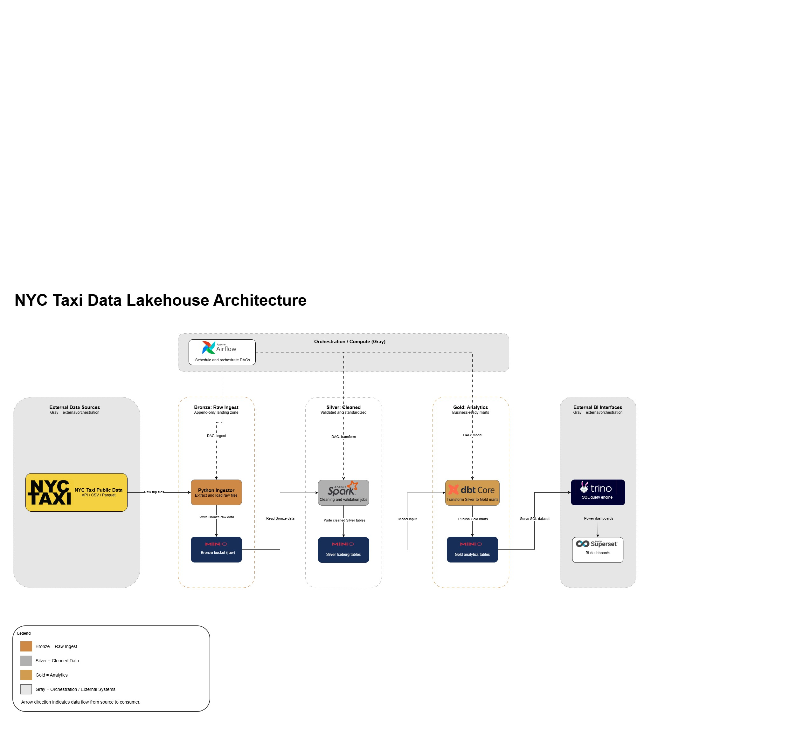

# NYC Taxi Data Platform - End-to-End Lakehouse

**Production-ready, config-driven data lakehouse platform** implementing a complete medallion architecture (Bronze → Silver → Gold) for NYC Taxi data.



> 🏗️ **Key Principle**: Engineers only update YAML files - no code changes needed to ingest or transform data.

## 🎯 What This Is

A **complete open-source data platform** that demonstrates modern data engineering best practices:

- **Medallion Architecture**: Bronze (raw) → Silver (clean) → Gold (aggregated)
- **Config-Driven**: All transformations and orchestration defined in YAML
- **Production-Ready Orchestration**: SparkSubmitOperator with health checks, dynamic task generation, and environment parameterization
- **Cloud-Native**: Runs on Docker, production-ready for Kubernetes
- **Open Standards**: Apache Iceberg, Spark, dbt, Trino
- **Automated Quality**: Data quality framework with lineage tracking and testing coverage

## 🏛️ Architecture

```text
┌──────────────────────────────────────────────────────────────┐
│                     DATA SOURCES                             │
│  NYC Taxi Data | APIs | Files | Databases                    │
└───────────────┬──────────────────────────────────────────────┘
                │
                ▼
      ┌─────────────────────┐
      │  Python Ingestors   │  ← Config-driven
      │  (Bronze Layer)     │     (YAML only)
      └──────────┬──────────┘
                 │
                 ▼
        ┌────────────────────────────────────────────┐
        │         BRONZE LAYER (Iceberg)             │
        │  • Append-only, immutable                  │
        │  • Raw data on MinIO/S3                    │
        │  • Partitioned by year/month               │
        └───────────────────┬────────────────────────┘
                            ▼
        ┌────────────────────────────────────────────┐
        │         SILVER LAYER (Spark)               │
        │  • Typed, validated, deduped               │
        │  • Config-driven transformations           │
        │  • Data quality checks                     │
        └───────────────────┬────────────────────────┘
                            ▼
        ┌────────────────────────────────────────────┐
        │          GOLD LAYER (dbt)                  │
        │  • Business aggregates                     │
        │  • Analytics-ready marts                   │
        │  • Modeled with dbt                        │
        └───────────────────┬────────────────────────┘
                            ▼
        ┌────────────────────────────────────────────┐
        │    ANALYTICS (Trino + Superset)            │
        │  • Ad-hoc queries with Trino               │
        │  • Dashboards with Superset                │
        └────────────────────────────────────────────┘

                  ▲
                  │ Orchestrates
        ┌─────────────────────────────────────────────┐
        │         AIRFLOW                             │
        │  • Schedules pipelines                      │
        │  • Manages dependencies                     │
        │  • Retry logic & monitoring                 │
        └─────────────────────────────────────────────┘
```

## ✨ Key Features

### 🔧 **Config-Driven Everything**

```yaml
# config/pipelines/lakehouse_config.yaml
bronze:
  source:
    type: http
    params:
      year: 2021
      month: 1
      
silver:
  transformations:
    filters:
      - "trip_distance > 0"
      - "fare_amount > 0"
    dedupe:
      enabled: true
      
gold:
  models:
    - name: daily_trip_stats
      aggregations:
        group_by: [year, month, location]
```

### 🎯 **Separation of Concerns**

| Layer | Responsibility | Technology |
|-------|---------------|------------|
| **Airflow** | WHEN things run | Orchestration |
| **Python** | Extract raw data | Ingestors |
| **Iceberg** | Store truth | Data lake |
| **Spark** | Clean & validate | Transformations |
| **dbt** | Define business logic | SQL models |
| **Trino** | Query analytics | SQL engine |
| **Superset** | Visualize | BI tool |

### 🚀 **Production Ready**

- ✅ **Idempotent**: Re-run anytime, same result
- ✅ **Replayable**: Historical data reprocessing
- ✅ **Testable**: Data quality at every layer
- ✅ **Monitored**: Airflow observability
- ✅ **Scalable**: Spark clusters for big data

## 🚀 Quick Start

### Prerequisites

- Docker Desktop (Windows) or Docker + Docker Compose (Linux/Mac)
- 8GB+ RAM recommended
- 20GB+ disk space

### 1. Clone and Start

```powershell
# Clone repository
git clone <repo-url>
cd nyc-taxi-data-ingestion

# Start all services
docker compose up -d

# Wait ~60 seconds for services to initialize
```

Note: If you pulled changes that pin `airflow-db` to a static IP, run `docker compose down` once so Docker can recreate the network before starting again.

### 2. Initialize Platform

```powershell
# Run setup script (Windows)
.\scripts\setup_lakehouse.ps1

# Or Linux/Mac
chmod +x scripts/setup_lakehouse.sh
./scripts/setup_lakehouse.sh
```

### 3. Access UIs

| Service | URL | Credentials |
|---------|-----|-------------|
| **Airflow** | http://localhost:8089 | airflow / airflow |
| **MinIO Console** | http://localhost:9001 | minio / minio123 |
| **Spark UI** | http://localhost:8080 | - |
| **Trino UI** | http://localhost:8086 | - |
| **Superset** | http://localhost:8088 | admin / admin |

### 4. Run Pipeline

**Option 1: Via Airflow UI** (Recommended)
1. Go to http://localhost:8089
2. Find `nyc_taxi_medallion_pipeline` DAG
3. Click the ▶️ Play button

**Option 2: Manual Execution**
```powershell
# Bronze layer
docker exec lakehouse-ingestor python /app/bronze/ingestors/ingest_to_iceberg.py --config /app/config/pipelines/lakehouse_config.yaml

# Silver layer
docker exec lakehouse-spark-master spark-submit /opt/spark/jobs/bronze_to_silver.py

# Gold layer
docker exec lakehouse-dbt dbt run --profiles-dir /usr/app
```

### 5. Query Data

```sql
-- Connect to Trino at localhost:8086

-- Bronze layer (raw data)
SELECT * FROM iceberg.bronze.nyc_taxi_raw LIMIT 10;

-- Silver layer (cleaned)
SELECT * FROM iceberg.silver.nyc_taxi_clean LIMIT 10;

-- Gold layer (analytics)
SELECT * FROM iceberg.gold.daily_trip_stats LIMIT 10;
```

## 📁 Project Structure

```text
nyc-taxi-data-ingestion/
├── config/                          # All configuration (YAML only!)
│   ├── pipelines/
│   │   └── lakehouse_config.yaml   # Master config for entire platform
│   ├── environments/               # Dev/staging/prod overrides
│   ├── datasets/                   # Dataset definitions
│   ├── schemas/                    # Config validation schemas
│   └── airflow/                    # Airflow variables per environment
│
├── bronze/                          # Raw data ingestion
│   └── ingestors/
│       └── ingest_to_iceberg.py    # Config-driven ingestion to Iceberg
│
├── silver/                          # Data cleaning & validation
│   └── jobs/
│       ├── bronze_to_silver.py     # Config-driven Spark transformations
│       ├── quality_checks.py       # Data quality checks
│       └── run_data_quality.py     # Quality runner
│
├── gold/                            # Analytics models
│   ├── models/analytics/           # dbt models (SQL)
│   ├── jobs/                       # Gold build scripts
│   ├── dbt_project.yml
│   └── profiles.yml
│
├── src/                             # Shared library code
│   ├── config_loader.py            # Core config loading
│   ├── config_validator.py         # Config validation
│   ├── enhanced_config_loader.py   # Enhanced loader with env support
│   ├── exceptions.py               # Custom exceptions
│   └── data_quality/               # Quality framework
│
├── airflow/                         # Orchestration
│   └── dags/
│       └── nyc_taxi_medallion_dag.py  # Main pipeline DAG
│
├── tests/                           # Test suite
│   ├── unit/                       # Fast isolated tests
│   ├── integration/                # Component interaction tests
│   ├── e2e/                        # Full pipeline tests
│   └── airflow/                    # DAG validation tests
│
├── docs/                            # All documentation (30+ guides)
├── scripts/                         # Setup & utility scripts
├── config.examples/                 # Example pipeline configs
├── archive/                         # Legacy pre-lakehouse scripts
├── trino/                           # Query engine config
├── superset/                        # Dashboard definitions
├── docker-init-scripts/             # DB & Hive init scripts
│
├── docker-compose.yaml              # Full stack definition
├── requirements.txt                 # Python dependencies
└── README.md                        # This file
```

## 🎛️ Configuration Guide

### Master Config: `config/pipelines/lakehouse_config.yaml`

This **single file** controls the entire pipeline. No code changes needed!

#### **Bronze Layer Config**

```yaml
bronze:
  source:
    type: http  # or: s3, postgres, api

    params:
      year: 2021
      month: 1
      taxi_type: yellow
      
  target:
    database: bronze
    table: nyc_taxi_raw
    storage:
      format: parquet
      partition_by: [year, month]
```

#### **Silver Layer Config**

```yaml
silver:
  transformations:
    # Rename columns
    rename_columns:
      tpep_pickup_datetime: pickup_datetime
      
    # Type casting
    cast_columns:
      fare_amount: decimal(10,2)
      
    # Filters
    filters:
      - "trip_distance > 0"
      - "fare_amount > 0"
      
    # Deduplication
    dedupe:
      enabled: true
      partition_by: [year, month]
      order_by: ["pickup_datetime DESC"]
      
    # Derived columns
    derived_columns:
      - name: trip_duration_minutes
        expression: "(unix_timestamp(dropoff_datetime) - unix_timestamp(pickup_datetime)) / 60"
```

#### **Gold Layer Config**

```yaml
gold:
  models:
    - name: daily_trip_stats
      aggregations:
        group_by: [year, month, day_of_week]
        measures:
          - name: total_trips
            expression: count(*)
          - name: avg_fare
            expression: avg(fare_amount)
```

## 🔄 How It Works

### The Config-Driven Flow

1. **Engineer updates YAML** (`lakehouse_config.yaml`)
   - Changes year/month to ingest
   - Adds new filters or transformations
   - Defines new Gold models

2. **Airflow triggers pipeline** (scheduled or manual)
   - No code deployment needed
   - Config is read at runtime

3. **Each layer reads config**
   - Bronze: Fetches data based on source config
   - Silver: Applies transformations from YAML
   - Gold: Generates dbt models from config

4. **Data flows through medallion**

   ```text
   Source → Bronze (raw) → Silver (clean) → Gold (aggregated) → Analytics
   ```

### Airflow DAG Structure

```python
# airflow/dags/nyc_taxi_medallion_dag.py
ingest_to_bronze >> transform_to_silver >> build_gold_models >> quality_checks
```

**Linear execution**:
1. Python ingestor writes to Bronze (Iceberg)
2. Spark job transforms Bronze → Silver
3. dbt builds Gold models
4. Quality checks validate results

## 🛠️ Common Operations

### Change Data to Ingest

```yaml
# config/pipelines/lakehouse_config.yaml
bronze:
  source:
    params:
      year: 2022        # ← Change this

      month: 6          # ← Change this

      taxi_type: green  # ← Or this (yellow, green, fhv)
```

Then trigger the DAG in Airflow.

### Add a New Transformation

```yaml
# config/pipelines/lakehouse_config.yaml
silver:
  transformations:
    derived_columns:
      - name: is_weekend         # ← New column

        expression: "dayofweek(pickup_datetime) IN (1, 7)"
```

Re-run the Silver layer task.

### Add a New Gold Model

```yaml
# config/pipelines/lakehouse_config.yaml
gold:
  models:
    - name: weekend_vs_weekday_stats  # ← New model

      aggregations:
        group_by: [year, month, is_weekend]
        measures:
          - name: trip_count
            expression: count(*)
```

Re-run the Gold layer task, or add a new dbt SQL file.

## 📊 Data Quality

### Bronze Layer

- Not null checks on key columns
- Positive value validation
- Schema consistency

### Silver Layer

- Range checks (e.g., passenger_count 1-10)
- Referential integrity
- Deduplication
- Type validation

### Gold Layer

- Aggregate validation
- Completeness checks
- Business logic tests (dbt tests)

## 🔍 Querying Data

### Using Trino CLI

```bash
# Connect to Trino
docker exec -it lakehouse-trino trino

# Query any layer
SELECT * FROM iceberg.bronze.nyc_taxi_raw WHERE year = 2021 LIMIT 10;
SELECT * FROM iceberg.silver.nyc_taxi_clean WHERE trip_distance > 10;
SELECT * FROM iceberg.gold.daily_trip_stats ORDER BY total_revenue DESC;
```

### Using Python

```python
from trino.dbapi import connect

conn = connect(
    host='localhost',
    port=8086,
    catalog='iceberg',
    schema='gold',
)

cursor = conn.cursor()
cursor.execute("SELECT * FROM daily_trip_stats LIMIT 10")
rows = cursor.fetchall()
```

## 🚀 Production Deployment

### Kubernetes Deployment

This platform is designed to run on Kubernetes. Key considerations:

1. **Persistent Volumes**: MinIO data, Metastore DB
2. **Secrets Management**: Use Kubernetes secrets for credentials
3. **Resource Limits**: Set appropriate CPU/memory limits
4. **Autoscaling**: Configure HPA for Spark workers
5. **Monitoring**: Integrate with Prometheus/Grafana

### Cloud Deployment (GCP)

This project includes Terraform-managed GCP infrastructure using **free-tier-only** resources with a **$2 budget cap**:

- **GCS Buckets**: Bronze (90-day lifecycle), Silver (180-day), Gold (permanent) — replaces MinIO for cloud storage
- **BigQuery**: Analytics dataset with partitioned/clustered tables (`daily_trip_stats`, `revenue_by_payment_type`, `hourly_location_analysis`)
- **IAM**: Dedicated service account with least-privilege roles (`storage.objectAdmin`, `bigquery.dataEditor`, `bigquery.jobUser`)
- **Budget Alert**: $2 hard cap with notifications at 50%, 90%, 100%

```bash
# Deploy GCP infrastructure
cd infrastructure/terraform-gcp
terraform init && terraform plan && terraform apply
```

See [Infrastructure Guide](docs/INFRASTRUCTURE.md#cloud-infrastructure-gcp) for full resource inventory and Terraform details.

**Managed Service Alternatives:**
- **Managed Airflow**: GCP Composer, AWS MWAA, or Astronomer
- **Managed Spark**: Dataproc, EMR, or Databricks
- **Catalog**: AWS Glue or BigQuery as metastore

## 🧪 Testing

```powershell
# Run tests
docker exec lakehouse-ingestor pytest /app/tests/

# Test data quality
docker exec lakehouse-dbt dbt test --profiles-dir /usr/app
```

## 📚 Documentation

| Guide | Description |
|---|---|
| [Getting Started](docs/GETTING_STARTED.md) | First-time setup walkthrough |
| [Architecture](docs/ARCHITECTURE.md) | System design deep dive |
| [Configuration](docs/CONFIGURATION.md) | Detailed config options |
| [Config Examples](docs/CONFIG_EXAMPLES.md) | Ready-to-use YAML samples |
| [Deployment](docs/DEPLOYMENT.md) | Production setup guide |
| [Infrastructure](docs/INFRASTRUCTURE.md) | Docker & service setup |
| [Data Quality](docs/DATA_QUALITY.md) | Quality framework & checks |
| [Performance](docs/PERFORMANCE_OPTIMIZATION.md) | Optimization guide |
| [Testing](docs/TESTING.md) | Test suite & coverage |
| [Quick Reference](docs/QUICK_REFERENCE.md) | Common commands |

## 🤝 Contributing

This is a demonstration project. To extend:

1. **Add new sources**: Implement in `bronze/ingestors/`
2. **Add transformations**: Update config or Spark jobs
3. **Add Gold models**: Create dbt SQL files
4. **Add quality checks**: Extend Great Expectations suite

## 📝 License

MIT License - See LICENSE file

## 🙏 Acknowledgments

- NYC TLC for open taxi data
- Apache Iceberg, Spark, Airflow communities
- dbt Labs for dbt-core

### Inspiration

Shout-out to these amazing data engineering content creators whose work inspired this project:

- [Alexey Grigorev](https://github.com/alexeygrigorev) - Data engineering and ML courses
- [Baraa Khatib Salkini](https://github.com/DataWithBaraa) - Data engineering tutorials and projects
- [Zach Wilson](https://github.com/EcZachly) - Data engineering and analytics content

---

**Built with ❤️ for modern data engineering**
